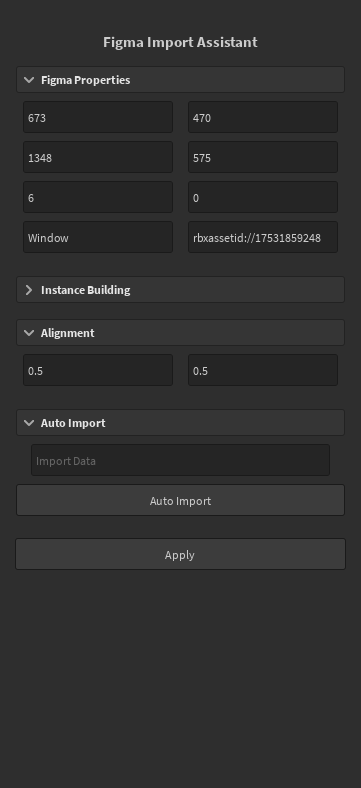

## Welcome To Figma Importer Assistant!
It’s a shame that Roblox Studio doesn’t natively support Figma imports, but with the help of this plugin, you can make the import process easier!

The plugin is designed with an intuitive and easy-to-use interface that speeds up your UI/UX workflow, and retains your original creation across all screen resolutions and devices.

Here is what it looks like in studio:

## How Does It Work?
There are two ways to import UI from Figma into Studio:
* Manually
* Automatically

Here is a video breaking down the basic usage of it, although this watch is optional and will be explained more in-depth later!


<!-- markdownlint-capture -->
<!-- markdownlint-disable -->
> This tutorial video is outdated, it will be updated soon.
{: .prompt-warning }
<!-- markdownlint-restore -->

You can view more information about basic usage by navigating to [manual importing](../posts/manualimporting/) or [automatic importing](../posts/automaticimporting/) tutorial pages.

## Installation

### Roblox Plugin
At minimum, you will need the Roblox plugin! Here are some options:
* Get it from the [Creator Hub page](https://create.roblox.com/store/asset/17426771250/Figma-Importer-Assistant)
* Download it from the [GitHub releases page](https://github.com/MiaGobble/Figma-Import-Assistant/releases)

<!-- markdownlint-capture -->
<!-- markdownlint-disable -->
> Downloading it from the Creator Hub ensures that you recieve automatic updates. If you want finer control though, download it from releases.
{: .prompt-tip }
<!-- markdownlint-restore -->

If you get it from the Github releases page, you can install it by inserting the `.rbxm` file into Studio, right-clicking it, and clicking "save as local plugin".

### Figma Plugin
You will need the Figma plugin in order to do automatic importing. You can get it from the [GitHub releases page](https://github.com/MiaGobble/Figma-Import-Assistant/releases).

Once downloaded:
* Unzip App folder
* In Figma, go to Plugins -> Development -> Import plugin from manifest
* Go to the unzipped App folder and import the file named "manifest"

## Better Than Alternatives? Yes!
Let’s face it, automating everything leads to a lack of customization and gives you a result you weren’t hoping for.

With other tools, you still have to put in the extra work to make it work with different devices via contextual scaling and aspect ratio constraints. With this plugin, you can customize how you import your content without the headache of scaling, aspect ratios, positioning, reclassing, and most importantly, how modular the UI is.

With auto-layout, you can customize a blockout to automatically be generated in just moments. All that’s needed is for you to export the images!

## Support This Plugin
Want to know how you can support this project? Here are some simple ways:
* Add the plugin to your library! Doing so helps the project reach out further, even if you never download it.
* Support me on my [Patreon page](https://www.patreon.com/c/iGottic) for just $1 a month.
* Leave feedback in DMs or in the replies below so that it can improve.